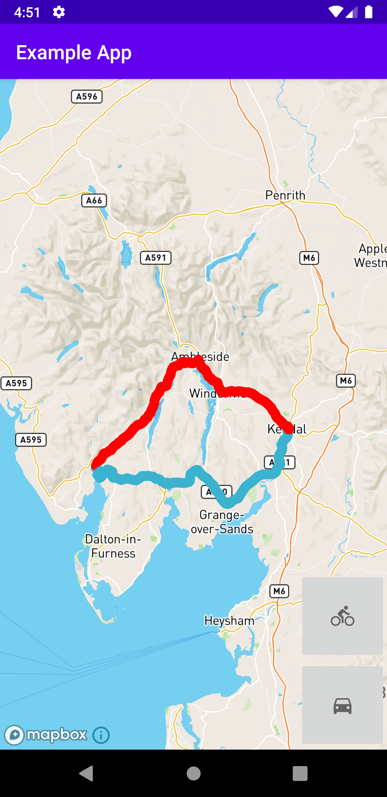
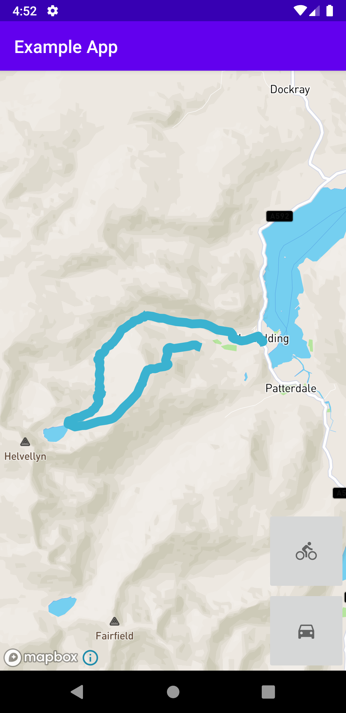

# brouter-android-lib
Attempting to provide a library wrapper to integrate [BRouter](https://github.com/abrensch/brouter/) into an Android app

## Compile

In order to compile you will need a Github username and [access token](https://github.com/settings/tokens) to get the packages. The example app uses the Mapbox SDK, which requires a Mapbox [access token](https://docs.mapbox.com/android/maps/overview/) the example app can be removed from the project to avoid the need for this.

## Usage

Initialise the library to ensure the folder structure with the app and profiles are extracted
```
val dir = context.getExternalFilesDir(null)
BRouter.initialise(context, dir)
```
You must manage the segment files as required
```
val segmentDir = BRouter.segmentsFolderPath(dir)
// copy segment files to this directory
```
Use the Builder to create the parameters class and generate a route
```
val params = RoutingParams.Builder(dir)
                .profile(BundledProfile.BIKE_TREKKING)
                .from(54.543592, -2.950076)
                .addVia(54.530371, -3.004975)
                .to(54.542671, -2.966995)
                .build()

val result = BRouter.generateRoute(params)
if (result.success) 
  // use result.track
else
  // use result.exception
```        

## Screenshots


Basic example of plotting the data
